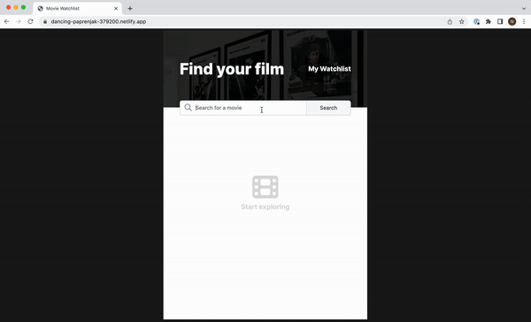

# Movie watchlist

Search for movies and save them to your watchlist

## Features
Users type in the movies they want to search for and then they can save them to their Watchlist. They can add or remove movies from their Watchlist even after refreshing the page and closing the window.

## Demo

Test it on Netlify: https://movie-watchlist-natalia-davtyan.netlify.app/

## Technologies
The project is built using:
* HTML
* CSS
* JavaScript
* API

## Technical details
* Used API to fetch the movies.
* Used JavaScript to render the movies and listen for clicks.
* Connected each add and remove buttons to their movies.
* Watchlist is saved in the localStorage.
* Followed the design file on Figma.

## Project status
The project is complete.

## Acknowledgements
Movie watchlist is a solo project that was part of [the Frontend Developer Career Path at Scrimba](https://scrimba.com/learn/frontend).

## Contact
Created by [Natalia Davtyan](https://github.com/nataliadavtyan)
